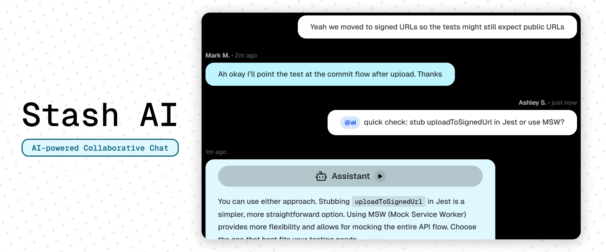

# Stash

Stash is a high-performance, real-time collaboration platform designed for modern teams. Built with the latest **Next.js 15+** features, it integrates seamless human-to-human communication with an on-demand, context-aware AI assistant with context + streaming, presence/typing indicators, voice messages, and AI text-to-speech.

## Try it out
[🚀 Live Preview](https://stash-psi-three.vercel.app/)

## Tech Stack

  
  
  

    
    
    
    
    
  

- **Next.js (App Router, TypeScript, React 19)**
- **Supabase** (`@supabase/supabase-js`) for realtime + database
- **Better Auth** for authentication (email/password + Google social login)
- **AI SDK + Groq** for assistant responses
- **Zustand** for lightweight client user state
- **Tailwind CSS** for UI styling
- **Lucide React** icons

## Core Features

- Realtime room chat with optimistic UI
- Pagination/infinite-scroll style history loading
- Realtime typing indicator (presence-based with stale event protection)
- `@ai` summon command:
  - sends last 10 text messages as context
  - streams response into UI
  - persists final assistant answer in DB (`role: 2`)
- Voice message recording/sending via browser microphone
- AI markdown rendering (inline + fenced code support)
- AI text-to-speech playback button (Web Speech API)
- Auth flows:
  - email/password login + signup
  - Google social login
  - pending/loading UI states
  - graceful server-side error handling routed back to UI

## Project Structure

- `app/`
  - `page.tsx`: session gate and app entry
  - `chat/page.tsx`: authenticated shell (sidebar + chat + signout)
  - `(auth)/login/page.tsx`, `(auth)/signup/page.tsx`: auth pages
  - `actions/`
    - `auth.ts`: server actions for auth
    - `room.ts`: server action for creating rooms
  - `api`
    - `chat/route.ts`: AI streaming endpoint + assistant message persistence
    - `auth/[...all]/route.ts`: Better Auth Next.js handler

- `components/`
  - `AudioPreview.tsx`: voice recording preview and audio player
  - `Chat.tsx`: chat state, realtime, typing, send flow, AI trigger, voice recording
  - `ChatBubble.tsx`: message rendering, markdown, AI chip + TTS, audio player
  - `Landing.tsx`: landing page
  - `Sidebar.tsx`: room listing + room creation
  - auth UI buttons (`AuthSubmitButton`, `GoogleAuthButton`, `SignOutSubmitButton`)
- `hooks/`
  - `use-hydrator.ts`: hydrates/clears user store from server 
- `lib/`
  - `auth.ts`: Better Auth server config
  - `auth-client.ts`: Better Auth client instance
  - `supabase.ts`: client-side Supabase instance
  - `time.ts`: timestamp parsingsession
- `public/`
  - `images/`: app images
- `store/`
  - `userStore.ts`: persisted current user metadata
- `types/`
  - `types.ts`: shared app types (`Message`, `Room`, etc.)

## Data/Message Conventions

- `message.role`
  - `1`: human/user
  - `2`: AI assistant
- `message.message_type`
  - `1`: text
  - `2`: voice (audio payload currently stored in `content`)

## Engineering Decisions

- **Authentication**
  - Better Auth for authentication with email/password and Google social login.
- **Database**
  - Supabase for complex relationships efficiently handled in PostgreSQL.
- **Presence via Supabase channel presence**
  - Robust typing indicator uses session-scoped key + stale timestamp checks.
- **AI assistant**
  - Context-rich Groq LPUs with Vercel AI sdk.
- **AI streaming UX**
  - UI streams assistant tokens immediately while server persists final content.
  - Temporary AI bubble is replaced by final DB event to avoid duplicates.
- **Graceful auth errors**
  - Server actions catch auth errors and redirect with `?error=...` for non-crashing UX.
- **Client-side TTS**
  - Uses free built-in browser `speechSynthesis` API.
- **Voice capture MVP**
  - Uses `MediaRecorder` directly in browser for simple cross-platform recording.

## Local Setup

1. **Install dependencies:**
   - `npm install`
2. **Create `.env.local` with required variables:**
   - `NEXT_PUBLIC_SUPABASE_URL`
   - `NEXT_PUBLIC_SUPABASE_ANON_KEY`
   - `SUPABASE_SERVICE_ROLE_KEY`
   - `SUPABASE_DATABASE_URL`
   - `BETTER_AUTH_SECRET`
   - `BETTER_AUTH_URL`
   - `GOOGLE_CLIENT_ID`
   - `GOOGLE_CLIENT_SECRET`
   - `GROQ_API_KEY`
3. **Run Migrations:**
   - `npx better-auth migrate`
4. **Run development server:**
   - `npm run dev`

## Useful Commands

- `npm run dev` - run local dev server
- `npm run lint` - lint checks
- `npm run build` - production build check